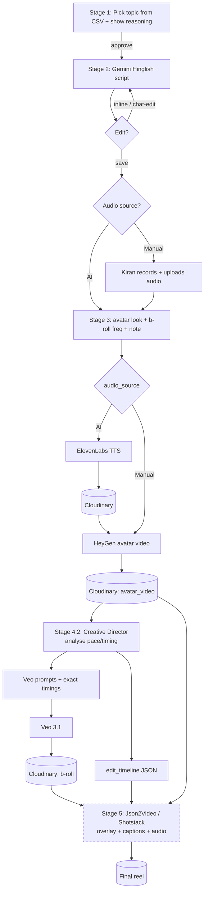

# Little Fern Reel Engine — Pipeline Spec (for Antigravity)

A single reel moves through **5 stages**, each a resumable job that writes to one shared `Reel` record. Three editable "brain" documents drive the AI steps; everything else is plumbing between five external services. v1 exists (built by Mithun) — this spec is the target to finetune toward.

---

## Services & knowledge artifacts

| External service | Used for |
|---|---|
| **Gemini** | Generate the Hinglish script (driven by the audio-style system prompt) + chat-edit |
| **ElevenLabs (V3)** | Text-to-speech in Kiran's voice |
| **Cloudinary** | Store + serve all media (audio, avatar video, B-roll, final) — pass **URLs**, never blobs |
| **HeyGen** | Generate the avatar video from an audio track |
| **Veo 3.1** ("Gemini Omni") | Generate B-roll clips (people/babies). Seedance only for non-human cutaways |
| **Json2Video / Shotstack** | Final assembly (replace B-roll at timestamps, burn captions, mux audio) — **manual for now** |

| Knowledge artifact (config, not code) | Powers |
|---|---|
| **Suggested-reels CSV** (topics + dual reasoning) | Stage 1 |
| **Kiran audio-style system prompt** (Gemini → ElevenLabs) | Stage 2 |
| **Creative Director prompt** (B-roll prompts + timings + edit instructions) | Stage 4.2 |

> Keep all three as editable config so Kiran/Pari can tune prompts without a code change.

---

## The `Reel` record (state that accumulates across stages)

```
Reel {
  id, status,                          // status drives which stage runs next
  topic, subbucket, reasoning,         // Stage 1
  script,                              // Stage 2 (editable, versioned)
  audio_source: "ai" | "manual",       // Stage 2 choice
  audio_url,                           // Cloudinary (ElevenLabs or uploaded)
  avatar_look, broll_frequency,        // Stage 3 choices
  creative_note,                       // Stage 3 free-text
  avatar_video_url,                    // Stage 4.1 (HeyGen, via Cloudinary)
  broll: [ {id, start, end, engine, prompt, clip_url} ],  // Stage 4.2
  edit_timeline,                       // Stage 4.2 (JSON for the editor)
  final_url                            // Stage 5
}
```

---

## The 5-stage flow

### Stage 1 — Topic selection & approval  `[HUMAN GATE]`
- **In:** Suggested-reels CSV. **Process:** surface top suggestions (filtered by season/priority) with both reasoning columns (general trends + past-reel learnings). **Out:** Kiran approves one topic → `topic, subbucket, reasoning` saved, status → `script_pending`.

### Stage 2 — Hinglish script  `[HUMAN GATE]`
- **In:** approved topic + audio-style system prompt. **Process:** Gemini drafts the script. Kiran can **(a)** edit inline and save, or **(b)** chat with the AI to revise (each save = a new version). Then he picks the **audio source:**
  - `ai` → script goes to Stage 4.1 for ElevenLabs.
  - `manual` → Kiran records audio himself and uploads it (→ Cloudinary `audio_url`), skipping ElevenLabs.
- **Out:** locked `script` + `audio_source`, status → `setup_pending`.

### Stage 3 — Production setup  `[HUMAN GATE]`
- **Process:** Kiran chooses **avatar look** (2–3 options, **default 1**), **B-roll frequency** (2–3 options, **default 1**), and an optional **creative note** (free text passed into the Creative Director step). **Out:** `avatar_look, broll_frequency, creative_note`, status → `generating`.

### Stage 4.1 — Avatar video
- **If `audio_source = ai`:** generate ElevenLabs audio → upload to Cloudinary (`audio_url`) → send to HeyGen with chosen `avatar_look` → receive raw avatar video → store on Cloudinary (`avatar_video_url`).
- **If `audio_source = manual`:** send the uploaded `audio_url` straight to HeyGen → `avatar_video_url`.
- *(Async — both ElevenLabs and HeyGen return via webhook/poll.)*

### Stage 4.2 — Creative Director → B-roll
- **In:** final audio (for **pace/timing analysis**), the script with its emotion tags, `broll_frequency`, `creative_note`, and the Creative Director prompt.
- **Process:** analyse audio timing → decide **where** B-roll is needed and **for how long** → emit per-clip **Veo prompts with exact in/out timestamps** → send prompts to Veo → receive clips → store on Cloudinary (`broll[].clip_url`). Also emit the **`edit_timeline`** (see contract below).
- **Out:** `broll[]` + `edit_timeline`, status → `assembly_pending`.

### Stage 5 — Assembly  `[MANUAL FOR NOW]`
- **In:** `avatar_video_url` (base), `broll[]` clips, `edit_timeline`, `audio_url`. **Process:** Json2Video/Shotstack overlays each B-roll at its timestamp, burns captions, muxes audio. **Out:** `final_url`, status → `done`. Automate later by feeding `edit_timeline` straight to the chosen API.

---

## The one contract that matters: Creative Director → editor (`edit_timeline`)

This is the engine-agnostic JSON the Creative Director must emit so Stage 5 can be automated later. A thin adapter maps it to Json2Video **or** Shotstack.

```json
{
  "reel_id": "K002-0613",
  "aspect_ratio": "9:16",
  "base_track":  { "src": "<cloudinary heygen url>", "audio_src": "<cloudinary audio url>" },
  "broll": [
    { "clip": 1, "start": 0.0,  "end": 4.0, "src": "<cloudinary veo url>", "mode": "fullframe", "engine": "veo31" },
    { "clip": 3, "start": 11.0, "end": 15.0,"src": "<cloudinary veo url>", "mode": "fullframe", "engine": "veo31" }
  ],
  "captions": [
    { "start": 0.0, "end": 4.0, "line1": "Yeh daane dekhe hain?", "line2": "kabhi?",
      "style": { "base": "white_stroke", "emphasis_line": 2, "emphasis_color": "yellow_italic" } }
  ]
}
```

---

## Flow diagram



*(Dashed = manual for now.)*

---

## What's manual now + finetune targets

- **Manual:** Stage 5 assembly. Everything before it should run end-to-end.
- **Finetune priorities:** (1) pace/timing accuracy in 4.2 so B-roll lands on the right word; (2) B-roll in/out precision against the audio; (3) caption generation from the script; (4) avatar-look presets; (5) cost/latency on HeyGen + Veo renders.

---

## Build notes for Antigravity

- **Each stage = an idempotent, resumable job** keyed off `Reel.status`; safe to retry without re-charging upstream services.
- **Three human gates:** topic approval (1), script approval + audio choice (2), production-setup confirm (3). Everything after 3 runs unattended until Stage 5.
- **All media lives in Cloudinary;** pass URLs between services, never raw files.
- **Async services (ElevenLabs, HeyGen, Veo) via webhook or poll;** store provider job IDs on the `Reel` so a crashed worker can reconcile.
- **The 3 knowledge docs are runtime config,** loaded per-run — not hardcoded — so prompt tuning never needs a deploy.
- **Version the script** (Stage 2 edits) and keep the chosen `audio_source` immutable once Stage 4 starts.
